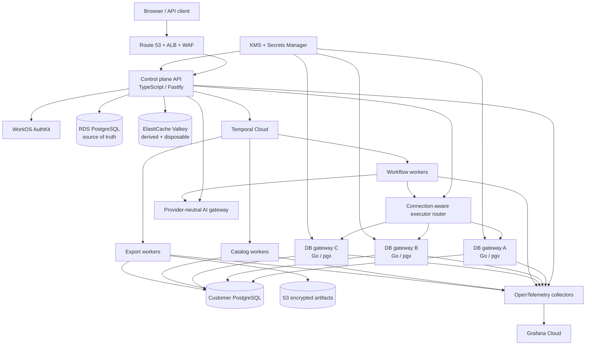
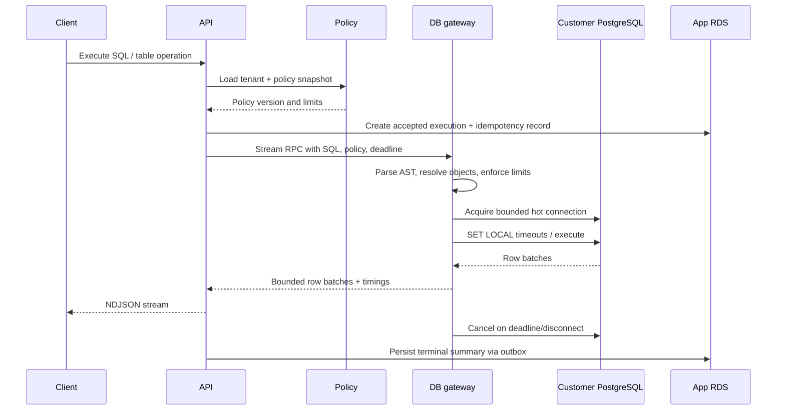

# ChatSQL — Greenfield Backend Platform Master Plan

> Status: proposed target architecture for the complete backend rewrite.
>
> Scope: backend, data plane, platform services, repositories, deployment, security, observability, capacity, reliability, and migration. UI design is intentionally out of scope.
>
> The existing [`BACKEND_SYSTEM_DESIGN.md`](./BACKEND_SYSTEM_DESIGN.md) remains the as-built description. [`BACKEND_ARCHITECTURE_REDESIGN.md`](./BACKEND_ARCHITECTURE_REDESIGN.md) is the code audit and explains why the current implementation should not be extended in place.

## 1. Executive decision

Build a new backend beside the current one and migrate tenants to it. Do not perform an in-place rewrite and do not create a large microservice estate.

The target is one platform repository with three application codebases and six independently scalable runtime services:

1. **TypeScript control plane** — public API, identity integration, tenant policy, catalog APIs, chat/session state, billing, and SSE.
2. **Go database gateway** — connection pooling, PostgreSQL AST policy, interactive query execution, row streaming, cancellation, catalog extraction, and exports.
3. **TypeScript Temporal orchestrators** — durable schema-sync, agent, export, maintenance, and migration workflows. Database-facing catalog/export activities run in the Go worker modes so credentials stay inside the data plane.

Use managed infrastructure for capabilities that are difficult to operate correctly:

- AWS ECS Fargate for containers;
- RDS PostgreSQL Multi-AZ for ChatSQL's application state;
- Temporal Cloud for durable workflows;
- ElastiCache for Valkey for cache, rate limits, leases, and wakeups only;
- S3 for exports, archives, and large asynchronous artifacts;
- KMS and Secrets Manager for encryption and platform secrets;
- WorkOS AuthKit for managed user authentication and enterprise identity;
- OpenTelemetry with Grafana Cloud for logs, metrics, traces, dashboards, and alerts;
- GitHub Actions, ECR, Terraform, and ECS blue/green releases for delivery.

Do **not** add Kafka, SQS, Kubernetes, OpenSearch, or ClickHouse to the first production architecture. Each has a future adoption gate in this plan. Installing all of them now would duplicate responsibilities, add network hops, and create more failure modes without improving interactive query latency.

The critical performance rule is:

> Interactive database work is executed directly by a warm, bounded database gateway. It is never placed on a background queue.

## 2. Why a greenfield rewrite is the better choice

The present system's slow and unsafe behavior comes from foundational boundaries rather than isolated implementation mistakes: interactive operations are jobs, customer pools are created per operation, results are buffered through Redis, authorization is regex-based, sync state is mutable and partial, and workflow state is either lossy or in memory.

Changing these in place would require replacing most request paths while retaining old contracts and failure semantics. A parallel backend gives the rewrite clean invariants:

- every request is tenant-scoped and fail-closed;
- one parsed statement and one policy decision per execution;
- bounded rows, bytes, duration, connections, and concurrency;
- durable state in PostgreSQL/Temporal, never only in cache;
- immutable catalog snapshots;
- backend-owned agent execution;
- logs contain metadata, never customer data;
- each plane can be scaled or degraded independently.

This is a complete implementation rewrite, not a product-feature reset. Existing features and data are migrated through explicit compatibility contracts.

## 3. Scope assumptions and decision criteria

### 3.1 Initial product boundary

- PostgreSQL is the only fully supported customer database in version 1 of the new platform.
- A database-adapter interface is still defined so MySQL or warehouses can be added later without weakening PostgreSQL correctness now.
- ChatSQL is multi-tenant SaaS. Customer databases can be public/allowlisted initially; a customer-hosted connector is planned for private networks.
- SQL console, table browsing/editing, catalog/ERD, AI chat/agent, exports, sharing/permissions, history, and billing remain product requirements.
- Customer query results are transient by default. Persistent result storage is opt-in and time-limited.

### 3.2 Architecture decision order

When choices conflict, optimize in this order:

1. Prevent unauthorized or duplicate database mutations.
2. Protect customer databases from connection/query storms.
3. Minimize time to useful data: bootstrap, first row, and first AI token.
4. Preserve correct state through process/dependency failures.
5. Keep the system understandable by a small team.
6. Minimize infrastructure cost only after the above are satisfied.

### 3.3 Measured service objectives

Remote database and LLM time must be reported separately from ChatSQL overhead.

| User-visible operation | Initial objective |
|---|---:|
| Cached workspace bootstrap | p95 under 150 ms |
| Uncached catalog response from app DB | p95 under 400 ms |
| Hot-pool execution dispatch overhead | p95 under 75 ms before customer DB time |
| Cold-pool dispatch overhead | p95 under 750 ms before customer DB time |
| First row for a fast query | p95 under 500 ms end to end |
| Cancel reaches PostgreSQL | p95 under 2 seconds |
| Initial schema/table discovery | under 2 seconds for a typical database |
| Detailed catalog | under 10 seconds for a typical database; progressive for large databases |
| AI first token | p95 under 1.5 seconds when provider is healthy |
| API availability | 99.9% monthly initially |
| Lost successful mutations | zero |
| Automatically repeated mutations | zero |

These become release gates after representative baseline tests; they are not claims about every remote database.

## 4. Target system



### 4.1 Control plane versus data plane

The **control plane** owns users, organizations, connections, encrypted credential records, policies, catalog metadata, execution records, plans, chats, audit, and workflow commands.

The **data plane** is the database gateway. It is the only hosted component allowed to connect to customer databases or see decrypted customer database credentials. It returns bounded streams, catalog batches, or S3 artifacts—not unbounded in-memory results.

The split creates a security and scaling boundary without turning each domain into a separate service.

## 5. Technology decisions

| Capability | Decision now | Why | Adoption/replacement gate |
|---|---|---|---|
| Public API | TypeScript, Node LTS, Fastify, Zod, OpenAPI | Existing team/product ecosystem; strong async and LLM SDK support; lower-overhead request path than the current Express layout | Change only for measured runtime limitations |
| Internal RPC | ConnectRPC/gRPC over HTTP/2 with protobuf | Typed contracts, deadlines, cancellation, server streaming, multi-language support | REST only for external compatibility |
| DB gateway | Go, `pgx/v5`, `pg_query_go`/`libpg_query` | Native PostgreSQL features, efficient streaming/concurrency, explicit cancellation, server parser grammar | Add adapter implementations for other databases later |
| App data access | SQL migrations + SQLC/Kysely-style typed queries; no runtime ORM schema sync | Visible SQL, predictable plans, compile-time contracts | ORM only where it does not hide queries/migrations |
| Durable workflow | Temporal Cloud | Durable timers, retries, signals/approvals, and restart recovery without building a workflow engine | Self-host only for a proven compliance/cost need |
| Cache/leases | ElastiCache Valkey, provisioned Multi-AZ | Fast disposable cache, rate limits, short leases, wakeups; managed failover | Serverless is acceptable if load is very bursty; benchmark first |
| Application DB | RDS PostgreSQL Multi-AZ | Strong transactions, familiar operations, sufficient scale for control-plane state | Aurora only after measured failover/read-scale/write-scale need |
| Object storage | S3 + lifecycle policies | Streamed exports and archives without app/Redis memory pressure | None expected |
| Identity | WorkOS AuthKit | Managed password/social/MFA plus organizations and enterprise SSO path | Cognito only if vendor consolidation outweighs product/admin UX |
| Authorization | ChatSQL policy service + app-DB RLS + customer-DB roles/RLS | Product-specific table/operation policies cannot be outsourced to login identity | Consider OpenFGA only when relationship policy complexity proves it necessary |
| Observability | OpenTelemetry collectors to Grafana Cloud | Vendor-neutral instrumentation and one managed logs/metrics/traces surface | Exporter can be changed without reinstrumenting applications |
| Runtime | ECS Fargate | Managed containers and isolation without operating Kubernetes nodes/control plane | EKS only for a platform team and Kubernetes-specific requirements |
| IaC/release | Terraform, GitHub Actions OIDC, ECR, ECS blue/green | Reviewable infra, no production SSH deploys, immutable releases, rollback | Add a deployment platform only when team/release count warrants it |
| Search/retrieval | PostgreSQL FTS/trigram; `pgvector` only when useful | Catalog is structured and relatively small | OpenSearch when measured search volume/features exceed PostgreSQL |
| Analytics store | PostgreSQL rollups initially | Avoid a second analytical datastore | ClickHouse when retained event/audit analytics harms app DB or reaches very large scale |

The native `pgx` interface exposes PostgreSQL-specific pooling, wire-protocol, `COPY`, tracing, and cancellation-friendly behavior, while PostgreSQL itself provides per-session read-only transactions and statement/lock/idle timeouts. See the [pgx project](https://github.com/jackc/pgx), [PostgreSQL client defaults](https://www.postgresql.org/docs/current/runtime-config-client.html), and [PostgreSQL cancellation](https://www.postgresql.org/docs/current/libpq-cancel.html).

## 6. Technologies deliberately excluded at launch

### 6.1 Kafka/MSK

Kafka solves durable, ordered, replayable event streams with many independent consumers. ChatSQL initially has commands and workflows, not a high-volume event-streaming platform. Temporal plus an app-DB outbox covers durability and fan-out without another cluster, schema registry, consumer-lag system, and operational team.

Add Kafka/MSK only when all or most of these become true:

- at least three independent consumer groups need replay of the same long-lived stream;
- events must be retained and reprocessed independently of operational records;
- the PostgreSQL outbox/dispatcher is a measured throughput bottleneck;
- CDC, cross-region streaming, or large analytical pipelines are real product requirements;
- the team is prepared to own event schemas, compatibility, partitions, lag, poison events, and replay procedures.

Kafka must never sit in the interactive query path.

### 6.2 SQS

SQS is excellent for simple asynchronous messages, but Temporal already supplies the durable task/workflow semantics needed here. Running Temporal and SQS for the same jobs creates two retry, dead-letter, visibility, and monitoring models.

Add SQS only for a simple AWS-native fan-out/integration that does not need workflow state, human approval, timers, or multi-step compensation.

### 6.3 Redis/Valkey queues

Do not use BullMQ in the new core platform. Valkey is cache and coordination, not durable business state or result storage. A total cache loss may make the app colder or temporarily reject new connection reservations; it must not lose operations, approvals, execution terminals, or audit events.

### 6.4 Kubernetes/EKS

The planned services need container scheduling, autoscaling, networking, secrets, health checks, and deployments. Fargate provides these without cluster/node management. EKS becomes reasonable only when a dedicated platform team, many services, specialized scheduling, service mesh, GPU workloads, or multi-cloud scheduling justify it.

### 6.5 Debezium/CDC for customer schemas

Schema metadata synchronization is not row-data replication. Use `pg_catalog` snapshots and optional DDL notifications. Never stream customer table rows into ChatSQL merely to keep a schema tree fresh.

## 7. Edge and API plane

### Responsibilities

- terminate public HTTPS at ALB;
- WAF rules, coarse IP abuse limits, and request size limits;
- session validation and tenant resolution;
- public REST/OpenAPI endpoints;
- workspace bootstrap and catalog reads;
- signed commands to the data/workflow planes;
- SSE for replayable operation events and AI streams;
- response compression where it benefits bounded JSON/NDJSON;
- idempotency handling for externally retried mutation commands.

### API rules

- Public APIs are versioned under `/v1`; internal protobuf contracts are versioned independently.
- Every endpoint declares tenant, permission, timeout, request/response size, idempotency, and audit behavior.
- Request timeouts become downstream RPC deadlines. A browser disconnect cancels the RPC and then the PostgreSQL query.
- Use route templates in telemetry; never use raw URLs, tenant IDs, connection IDs, or SQL as metric labels.
- Normal interactive execution bypasses Temporal and Valkey queues.
- `/live` checks only process liveness. `/ready` checks the app DB and the dependencies required for that process role. `/health/dependencies` can expose sanitized degraded state to operators.

### Fast workspace bootstrap

One versioned bootstrap request should return the connection summary, effective capabilities/limits, active catalog generation, compact schema/table tree, sync freshness/state, and the IDs needed to resume recent backend sessions. Serve the last-known-good catalog immediately and revalidate it asynchronously. This avoids a serial chain of connection, permission, schema, sync-status, and plan requests during every load.

Long operations expose an accepted operation ID immediately. Streams distinguish `accepted`, `waiting_for_capacity`, `running`, `first_row`, `truncated`, and terminal state so the client can be responsive without inventing status or polling rapidly.

### Protocols

| Path | Protocol | Use |
|---|---|---|
| Client to API | HTTPS REST/JSON | commands, metadata, bounded results |
| Query result stream | HTTPS NDJSON or chunked JSON | row batches and terminal metadata |
| Progress/chat | SSE with event IDs | one-way token/progress events and replay |
| API to DB gateway | ConnectRPC/gRPC | typed unary and server-streaming calls with deadlines/cancel |
| API/workers to Temporal | Temporal SDK | workflow start, signal, update, query |

Use an HTTP-only secure session cookie. If an EventSource client cannot attach required headers, mint a short-lived, single-use stream ticket rather than placing a long-lived JWT in the URL.

## 8. Identity, tenant, and policy plane

### Identity

WorkOS AuthKit handles credential authentication, MFA, social login, account recovery, and future enterprise SSO. ChatSQL remains authoritative for organizations, memberships, subscriptions, connection ownership, and database permissions. AuthKit supports hosted authentication and organization-oriented flows; see the [AuthKit overview](https://workos.com/docs/authkit/overview).

### Tenant isolation

- Every tenant-owned application row has `organization_id`.
- RDS PostgreSQL row-level security applies `organization_id` policies.
- The application sets tenant context with `SET LOCAL` inside each transaction.
- Ordinary app roles do not have `BYPASSRLS`; migration/maintenance roles are separate and tightly scoped.
- Background workflow inputs contain stable organization/resource IDs and reload current policy before a sensitive step.
- Object keys, cache keys, traces, and audit records are tenant scoped; customer-visible IDs are opaque UUIDv7/ULID values.

### Authorization layers

1. **Product policy** — organization, plan, role, connection, schema/table, operation, export, AI, and time limits.
2. **SQL lineage policy** — AST-resolved referenced objects and statement capabilities.
3. **Customer PostgreSQL principal** — least-privileged DB role and native PostgreSQL RLS/permissions as the final boundary.

Authorization fails closed on timeout, cache miss, or app-DB error. Policy snapshots include a version/hash; cached decisions can only be used inside a short TTL and are invalidated by version changes.

## 9. Customer connection and secret plane

### Credential storage

- Secrets Manager stores platform secrets such as provider keys and signing material.
- Customer connection credentials are encrypted blobs in the app DB using KMS envelope encryption, with key ID, encrypted data key, algorithm version, credential version, and organization/connection encryption context.
- One Secrets Manager secret per customer database is not required; it would add management and read overhead without improving the encryption boundary.
- Plaintext credentials exist only in a DB-gateway process for the shortest practical in-memory TTL and are never serialized to Temporal, Valkey, logs, traces, or crash reports.
- Rotation creates a new credential version, invalidates all matching pools, tests the new connection, and only then activates it.

AWS Secrets Manager uses KMS-backed envelope encryption; the same design principle is applied to customer credential blobs. See [AWS secret encryption](https://docs.aws.amazon.com/secretsmanager/latest/userguide/security-encryption.html).

### Network protection

- DB gateway tasks run in isolated private subnets with no inbound public route.
- Each Availability Zone has controlled outbound NAT with documented static egress IPs for customer allowlists.
- Resolve DNS and validate every A/AAAA result before connection and again on reconnect.
- Deny loopback, link-local, cloud metadata, multicast, and unexpected private ranges by default.
- Private destinations require an explicit private-connectivity product path, never a hostname bypass.
- Require TLS certificate verification by default; support customer-provided CAs and explicit hostname/SNI.
- Internal service calls use TLS and workload IAM/mTLS; task roles follow least privilege.

### Private-database connector

Create a third repository only when this feature is implemented: a small customer-hosted connector that makes an outbound mTLS connection to ChatSQL, accepts narrowly scoped signed requests, and connects locally to private databases. Its trust, release, compatibility, and security-review lifecycle justify a separate repo.

## 10. Interactive query-execution plane

### 10.1 Request lifecycle



### 10.2 Connection-aware routing and pools

All API replicas use service discovery plus rendezvous hashing on `connection_id` to choose a healthy home DB-gateway task. This keeps most traffic for a connection on one warm pool without making task identity durable. A second-choice task handles failure.

Each gateway:

- keys pools by connection ID and credential version;
- starts with a maximum of two connections per customer DB, configurable by plan and DB capacity;
- keeps pools warm only for recently active connections and evicts idle pools after roughly 5–10 minutes;
- serializes pool creation with a local single-flight guard;
- obtains short Valkey leases for distributed per-connection and per-tenant connection budgets;
- limits active queries separately from open idle connections;
- applies circuit breaking and jittered reconnect backoff after connection failures;
- exposes pool wait, connect, TLS, first-row, total query, cancellation, and close timings.

Valkey loss must not terminate running queries. It should prevent unsafe creation of additional distributed pool capacity until leases are reliable again. Local hard caps remain in force.

### 10.3 SQL parsing and policy

- Parse with PostgreSQL's own grammar through `pg_query_go`/`libpg_query`, not a regular expression and not a generic dialect parser.
- Permit exactly one statement by default.
- Determine statement type and referenced relations across joins, CTEs, subqueries, views, DML `RETURNING`, functions, and quoted identifiers.
- Resolve unqualified names against a controlled `search_path` and the active catalog version.
- Reject unsupported or policy-ambiguous syntax rather than guessing.
- Restricted read queries run inside `BEGIN READ ONLY` with `statement_timeout`, `lock_timeout`, `idle_in_transaction_session_timeout`, and `transaction_timeout` where the connected PostgreSQL version supports it, all appropriate to the operation/plan.
- Mutations run in an explicit transaction with a separately authorized capability set.
- Do not automatically retry any DML or DDL. Client retries require an idempotency key and return the original terminal outcome.

### 10.4 Bounded streaming

- Default preview: at most 1,000 rows and 10 MiB, configurable by product plan but always subject to a server hard cap.
- Fetch in bounded batches; apply backpressure from the HTTP stream to PostgreSQL.
- Record a query fingerprint, not raw SQL, in ordinary telemetry.
- Store only terminal metadata and optionally a small redacted preview in history.
- Large/full results become an asynchronous export streamed directly to S3.
- On disconnect/cancel/deadline, issue PostgreSQL cancellation and close the transaction cleanly.

### 10.5 Table browsing and editing

- Cursor/keyset pagination over an explicit stable primary or unique key; support composite keys.
- Fetch `limit + 1` to derive `has_next_page`.
- Exact `COUNT(*)` is optional/asynchronous; show PostgreSQL estimates first when useful.
- Typed filters compile from a structured request, never concatenated text.
- Avoid `CAST(... AS TEXT) ILIKE` across arbitrary columns as a default search mode.
- Use `RETURNING` for inserts/updates/deletes.
- Use a real version column where available, otherwise PostgreSQL `xmin`, for optimistic conflict detection.
- Bulk edit has explicit transaction size and affected-row limits.

## 11. Catalog and schema-sync plane

### Durable workflow

Temporal coordinates one active sync per connection. Repeated requests are coalesced into `refresh_requested`; they do not create timestamp-unique duplicate jobs. [Temporal](https://docs.temporal.io/) is designed so workflow execution resumes after crashes and infrastructure failures.

### Immutable snapshots

Core records:

- `catalog_sync_runs` — reason, state, attempt, requested/started/finished timestamps, error class, statistics;
- `catalog_snapshots` — connection, generation, phase, source fingerprint, validation, published time;
- snapshot-scoped schemas, relations, columns, types, constraints, indexes, functions, comments, and relationships;
- `connections.active_catalog_snapshot_id` — the last successfully published version.

A worker opens one read-only repeatable-read customer transaction, uses a small fixed set of set-based `pg_catalog` queries, groups results, bulk loads/COPYs them into new snapshot tables, validates counts/references, and atomically changes the active pointer. A failed refresh cannot expose a partial catalog or delete the last-known-good snapshot.

### Progressive freshness

1. Publish schema/table discovery quickly.
2. Publish a fully validated detailed generation.
3. Refresh a specific table/schema after ChatSQL-executed DDL.
4. Run adaptive reconciliation based on connection activity and snapshot age.
5. Offer an optional customer-installed DDL notifier/connector for near-real-time metadata changes.
6. Always retain periodic full reconciliation because notifications can be lost or bypassed.

### Versioned caching

Catalog cache keys include the immutable generation:

```text
catalog:{connection}:v{generation}:tree
catalog:{connection}:v{generation}:relation:{relation}
catalog:{connection}:v{generation}:ai:{policy_hash}
```

Publishing changes one small active-generation pointer. Old cache entries expire naturally. Use single-flight cache fill and stale-while-revalidate for safe catalog reads. Do not warm every large document on every sync.

## 12. Workflow, operation, and event plane

### Temporal task queues

Use separate Temporal task queues and worker services for:

- control workflows: agent state, approvals, timers, billing reconciliation, cleanup;
- catalog activities: introspection and snapshot publication;
- export activities: customer query to multipart S3 upload;
- migration/backfill activities during the cutover.

Temporal retries are allowed for idempotent activities. A mutation execution activity is not generically retried; it uses a recorded execution/idempotency state machine.

### Durable operation state

App RDS stores product-visible operations and monotonically increasing operation events:

```text
accepted -> running -> streaming -> succeeded
                                -> failed
                                -> cancelled
                                -> timed_out
```

The app-DB transaction writes state plus an outbox event. A dispatcher publishes a Valkey wakeup, but clients replay authoritative events from RDS using `Last-Event-ID`. Losing Valkey may delay a wakeup; it never loses terminal state.

Do not duplicate all Temporal history in product tables. Store only user/audit-visible state and the Temporal workflow/run identifiers needed for correlation.

## 13. AI and agent plane

### AI gateway

- One provider-neutral interface for streaming completion, structured generation, embeddings, token/cost accounting, and cancellation.
- Provider/model selection is configuration, not domain code.
- Per-provider timeouts, circuit breakers, concurrency budgets, and health-based fallback.
- Cancel provider generation when the client or workflow no longer needs it.
- Deterministic catalog retrieval first: lexical/schema match, FK-neighbor expansion, recent-query signals; use `pgvector` embeddings only when they measurably improve retrieval.
- Prompts receive the smallest authorized catalog subgraph and never decrypted credentials.
- Do not send result rows to model providers unless the user explicitly invokes a feature that needs them and policy permits it.

### Durable agent

```text
planning -> awaiting_approval -> approved -> executing -> succeeded -> next_step/completed
                          |                         |
                          -> rejected               -> failed -> repairing -> awaiting_approval
```

Temporal owns this state machine. Signals/updates carry approval, rejection, stop, and correction. Each transition uses expected workflow version, authenticated user, organization, connection, policy version, proposed SQL hash, and expiry.

After approval, the backend DB gateway executes the exact approved SQL hash. The browser never executes agent SQL on its own and never reports an authoritative result. DDL/DML steps require stronger permission and an explicit audit record.

## 14. Application data plane

### Primary domain groups

| Domain | Important records |
|---|---|
| Identity/tenant | users, organizations, memberships, invitations, external identity IDs |
| Connections/secrets | connections, credential versions, network/TLS config, tests, health summaries |
| Policy | roles, grants, policy revisions, share links, approval requirements |
| Catalog | sync runs, immutable snapshots, schemas, relations, columns, constraints, indexes |
| Execution | executions, idempotency records, bounded history metadata, cancellations |
| Workflow/events | operations, operation events, outbox, workflow references |
| AI/chat | sessions, messages, agent steps, approvals, provider usage and budgets |
| Billing | customers, subscriptions, entitlements, metering, verified webhook events |
| Audit | append-only security and data-operation audit events |

### Database practices

- Versioned SQL migrations; no table creation or sync-on-start.
- Expand/contract migrations compatible with the previous and next application versions.
- Foreign keys and check constraints enforce domain invariants.
- Composite indexes match measured access paths.
- Time-partition high-growth execution, operation-event, usage, and audit tables when volume warrants it.
- Read replicas are not initially required. Add them only for proven catalog/history analytical reads that tolerate replica lag.
- Add RDS Proxy only when API/worker connection churn or task scaling measurably pressures RDS connections.
- Transactional outbox for audit, usage, event wakeups, cache invalidation, and external side effects.

RDS Multi-AZ provides a standby/failover topology, while a Multi-AZ DB cluster can also expose read capacity. Start with the simpler Multi-AZ PostgreSQL deployment and benchmark before choosing a larger topology; see [AWS RDS Multi-AZ](https://docs.aws.amazon.com/AmazonRDS/latest/UserGuide/Concepts.MultiAZ.html).

## 15. Cache policy

Valkey may contain:

- compact catalog documents keyed by generation;
- short-lived identity/policy snapshots keyed by policy version;
- rate-limit counters;
- idempotent single-flight/lease records;
- connection-budget reservations;
- SSE/outbox wakeups;
- provider health/circuit-breaker coordination.

Valkey must not contain:

- durable operation state;
- workflow state or the only copy of an event;
- customer credentials;
- full query results or exports;
- unbounded job payloads;
- arbitrary customer table-row caches by default.

Production uses one provisioned Valkey shard with a replica in another AZ, automatic failover, encryption in transit/at rest, ACLs, and explicit max-memory policy. ElastiCache Multi-AZ promotes a replica on primary failure; see [AWS ElastiCache failover](https://docs.aws.amazon.com/AmazonElastiCache/latest/dg/AutoFailover.html).

## 16. Export and artifact plane

- Export is a Temporal workflow with a stable operation ID.
- The export worker streams from a read-only PostgreSQL transaction into a multipart S3 upload; it does not materialize the full result.
- Enforce row, byte, duration, organization concurrency, and retention limits.
- Objects use SSE-KMS, tenant-scoped prefixes, checksum, content type, creator/policy metadata, and lifecycle deletion.
- A short-lived presigned URL is returned only after authorization is rechecked. Presigned URLs are bearer capabilities and must have short expiry; see [S3 presigned URLs](https://docs.aws.amazon.com/AmazonS3/latest/userguide/using-presigned-url.html).
- Aborted/failed multipart uploads are cleaned by lifecycle policy and a reconciliation workflow.

## 17. Billing, entitlement, and usage plane

- Verify and persist payment webhooks idempotently before applying them.
- Convert provider-specific subscription state into a versioned local entitlement snapshot: connections, query/export limits, AI budget, retention, and concurrency.
- Interactive requests read the local entitlement snapshot; they never call the payment provider in the request path.
- Usage writes to a transactional outbox and aggregates asynchronously. Security and hard concurrency limits remain synchronous.
- A Temporal reconciliation workflow compares local subscription/entitlement state with the payment provider and repairs missed/out-of-order webhooks.
- Plan downgrade uses explicit grace and enforcement rules; it never silently broadens permissions or interrupts an already committed mutation.

## 18. Observability plane

### 18.1 Standard

Instrument all services with OpenTelemetry and export asynchronously to two or more collector gateway tasks. Collectors perform memory limiting, batching, redaction, resource enrichment, retry, and tail sampling before Grafana Cloud. OpenTelemetry collectors support receiver/processor/exporter pipelines and processors such as batching, memory limiting, redaction, and sampling; see the [collector processor documentation](https://opentelemetry.io/docs/collector/components/processor/). Grafana Cloud accepts OTLP logs, metrics, and traces through managed storage; see [Grafana Cloud telemetry ingestion](https://grafana.com/docs/grafana-cloud/send-data/).

Instrumentation remains vendor-neutral. Grafana is the initial managed backend, not an SDK dependency.

### 18.2 Structured log contract

TypeScript uses Pino with an OpenTelemetry transport. Go uses `slog` or Zap with the same JSON fields.

Required fields where applicable:

```text
timestamp, severity, service, version, environment, region,
trace_id, span_id, request_id, operation_id, execution_id,
workflow_id, route_template, operation_type, outcome,
duration_ms, error_class, retryable
```

Organization, user, and connection identifiers are hashed/tokenized for operational logs. The clear identifiers live only in access-controlled audit records.

Never log:

- credentials, connection strings, cookies, tokens, headers, or KMS plaintext;
- SQL text, prompts, model responses, table names, row values, result previews, or S3 signed URLs;
- complete request/response bodies;
- one message per query row, stream chunk, polling interval, cache item, or catalog object.

Use bounded metadata instead: SQL fingerprint, statement type, object count, row/byte count, catalog generation, provider/model alias, and error class.

### 18.3 Log levels in production

| Level | Production policy | Examples |
|---|---|---|
| `TRACE` | Compile/runtime disabled. Enable for one service/request correlation for a short expiring diagnostic window only. | parser phases, individual RPC frames |
| `DEBUG` | Disabled by default; dynamically enabled with TTL and sampling. Never customer payloads. | cache decision, pool reuse, policy rule ID |
| `INFO` | Lifecycle and terminal business events only; successful request-access logs are sampled because traces/metrics carry the baseline. | deployment ready, workflow terminal, credential rotation activated |
| `WARN` | Recoverable degradation, deduplicated/rate-limited by error key. | provider fallback, circuit open, cache unavailable, retry scheduled |
| `ERROR` | Unexpected terminal failure requiring investigation; include sanitized stack and correlation. Never sample away, but deduplicate storms. | invariant failure, exhausted durable workflow, persistent data corruption check |
| `FATAL` | Startup/configuration/invariant failure followed by process exit. | invalid signing keys, incompatible schema, impossible security configuration |
| `AUDIT` | Separate append-only schema and pipeline; never sampled or dropped. | login/security change, connection access, policy change, approved DDL/DML/export |

Normal successful API traffic should emit metrics and spans, not several info lines. One execution produces a bounded terminal summary; row batches produce zero logs.

### 18.4 Sampling and backpressure

- Metrics: 100%, low-cardinality labels only.
- Failed, slow, security-relevant, and dependency-degraded traces: 100% retained through tail sampling.
- Healthy traces: start at 2%; tune by traffic and cost.
- Warnings/errors: retained, with repeated-message aggregation and rate limits.
- Healthy access logs: start at 1% or disabled where traces cover the need.
- SDK exporters use bounded queues and batch OTLP off the request path.
- Collector memory limit rejects/drops low-priority telemetry before application memory is threatened.
- Under pressure, drop trace/debug, then sampled info; never block queries and never drop transactional audit records.

### 18.5 Metrics without cardinality explosions

Required histograms/gauges/counters include:

- API latency/errors by route template and status class;
- platform overhead, customer query duration, first-row, rows, bytes, truncation, cancellation;
- pool open/idle/in-use/wait/churn/connect/TLS failures;
- tenant and connection concurrency rejections, reported in aggregate by plan/tier—not tenant ID;
- catalog schedule-to-start, stages, object counts, publication failures, stale age, coalescing;
- Temporal schedule-to-start/task latency/failure/retry by task queue and activity type;
- cache hit/miss/stale/eviction/latency and lease failures;
- SSE connections, replay count, event lag, client disconnects;
- Node event-loop lag/heap/GC and Go goroutines/heap/GC;
- RDS pool wait/transactions/slow queries and Valkey latency/memory;
- AI time to first token, completion duration, provider fallback, token/cost budgets, abandoned streams;
- outbox backlog/age and audit publication lag.

Never label metrics with organization, user, connection, workflow, execution, SQL fingerprint, table, prompt, or error message. Those belong in traces/log search.

### 18.6 Initial retention

| Signal | Starting retention |
|---|---:|
| Sampled traces | 7 days |
| Application logs | 14 days searchable; archive only when justified |
| Security/error logs | 30–90 days searchable |
| Metrics and SLO history | 13 months |
| Product operation events | 30–90 days, plan-dependent |
| Audit records | 1 year minimum, configurable for contractual/regulatory needs |
| Query text/result previews | off by default or shortest product-required retention |

Retention is a product/legal policy and must be revisited before enterprise launch.

## 19. Reliability, overload, and failure behavior

### Bulkheads

- API, interactive gateway, catalog, export, workflows, and telemetry have separate ECS services and scaling.
- Per-organization, per-connection, and global query semaphores.
- Separate catalog/export concurrency so a huge schema or export cannot consume interactive slots.
- Provider-specific AI concurrency and spend budgets.
- Honest `429` for tenant limits and `503` for unavailable capacity, with bounded retry hints.

### Dependency behavior

| Failure | Required behavior |
|---|---|
| Valkey unavailable | Existing interactive work can finish; cache miss uses app DB; reject unsafe new distributed pool reservations; no state loss |
| Temporal unavailable | Interactive reads/queries continue; new durable workflows return degraded/unavailable; running workflow state is preserved by Temporal |
| Grafana/collector unavailable | Bounded local telemetry buffers; drop low priority; application continues; audit still commits to app DB |
| App RDS unavailable | Fail closed for auth/policy/new execution; running gateway query may be cancelled; no privilege fallback |
| One gateway task dies | Client receives clear failure/reconnect; PostgreSQL connection closes; router chooses next healthy task; no automatic mutation replay |
| Customer DB slow/down | Circuit breaker, deadlines, bounded pools, scoped error; other tenants unaffected |
| AI provider down | Circuit breaker/fallback; DB browsing and SQL execution unaffected |
| One AZ fails | ALB/ECS shifts to healthy tasks; RDS/Valkey fail over; NAT and collectors remain available in another AZ |

### Availability and recovery targets

- Production starts in one AWS region across three Availability Zones.
- Initial target: RPO under 5 minutes and RTO under 30 minutes for the control plane.
- RDS automated backups and point-in-time recovery; encrypted cross-region snapshots on a tested schedule.
- S3 versioning where appropriate, lifecycle/replication for critical audit/archive buckets.
- Terraform remote state with locking, versioning, and separate recovery access.
- Quarterly restore test and twice-yearly AZ/dependency failure exercise.
- Multi-region active/active is not phase-one work. Add regional executor cells before duplicating the control plane globally.

## 20. Regional evolution

Start with a single home region close to the initial customer base. The control plane and customer data plane run there.

When customer DB latency or residency requires it:

1. deploy a DB-gateway/catalog/export **regional cell** near customer databases;
2. assign each connection a home execution region;
3. keep credentials encrypted and only decrypt in the assigned region;
4. keep the control plane centralized initially, with regional signed commands and local streams;
5. add a customer-hosted outbound connector for private networks;
6. duplicate the control plane only when residency/RTO requirements justify the consistency complexity.

## 21. Repositories and ownership

Use two repositories now and a third later:

### 21.1 `chatsql-web`

The existing frontend repository. It owns browser behavior and generated API clients, not backend domain logic.

### 21.2 `chatsql-platform`

One monorepo for the entire new backend and infrastructure:

```text
chatsql-platform/
  apps/
    api/                  # TypeScript Fastify control plane
    orchestrator/         # TypeScript Temporal workflows/activities
    db-gateway/           # Go interactive/catalog/export binaries
  packages/
    contracts/            # protobuf, OpenAPI, generated clients
    domain/               # pure TypeScript domain/policy types
    observability/        # shared OTel/log schemas
    testkit/              # fixtures, containers, load/fault helpers
  db/
    migrations/
    queries/
  infra/
    terraform/
      modules/
      environments/dev/
      environments/staging/
      environments/prod/
  deploy/
    ecs/
    otel/
  docs/
    adr/
    runbooks/
    threat-models/
    api/
```

The Go gateway builds modes or commands for `serve`, `catalog-worker`, and `export-worker`; separate ECS services run them with different IAM, networking, resources, and concurrency.

Do not create one repo per microservice. Shared contracts, atomic security changes, coordinated migrations, and one CI graph are advantages at this team/product stage.

### 21.3 `chatsql-connector` later

Separate repo for the customer-installed private network connector because it has an external release channel, long compatibility window, installer/signing needs, public security surface, and no access to internal application packages.

## 22. Production runtime and starting capacity

These are safe starting hypotheses, not sizing promises. A representative load test and a two-week staging/production observation window determine final values.

| ECS service | Minimum tasks | Starting task size | Initial local concurrency | Scale signal / maximum |
|---|---:|---:|---:|---|
| API/control plane | 2 | 1 vCPU / 2 GiB | request/SSE bounded by event-loop and memory | request concurrency, p95, CPU, event-loop lag; max 20 |
| Interactive DB gateway | 3, one per AZ where possible | 2 vCPU / 4 GiB | 32 active queries, subject to stricter pool budgets | active-slot utilization, pool wait, first-row latency; max 30 |
| Temporal control worker | 2 | 1 vCPU / 2 GiB | 20 workflow tasks; activity-specific caps | schedule-to-start latency; max 10 |
| Catalog worker | 2 | 2 vCPU / 4 GiB | 2 active syncs per task | catalog queue age and CPU/memory; max 20 |
| Export worker | 1 on-demand | 2 vCPU / 4 GiB | 1–2 exports per task | export queue age/bytes; max 10; Spot only for retryable burst |
| OTel collector gateway | 2 | 0.5 vCPU / 1 GiB | bounded memory/batch queues | accepted/refused telemetry, CPU/memory; max 6 |

Baseline: 12 always-on Fargate tasks. ECS services maintain desired task count, while Fargate avoids managing instances; see [Amazon ECS/Fargate](https://docs.aws.amazon.com/AmazonECS/latest/developerguide/Welcome.html).

### Managed state starting shape

- RDS PostgreSQL: Multi-AZ, 2 vCPU / 8 GiB class, encrypted gp3 storage with autoscaling and PITR.
- Valkey: one provisioned shard, primary plus one replica in different AZs, roughly 1–2 GiB memory to start.
- Temporal Cloud: one production namespace in the same geography, separate staging namespace, retention selected for workflow/debug needs.
- S3: separate export, audit/archive, and deployment-artifact buckets with independent IAM/lifecycle.
- KMS: separate keys for application secrets, customer connection envelopes, S3 exports, and audit archives where separation is useful.

### Connection budgets

The global customer-DB connection budget—not Fargate CPU—limits data-plane scale. Start with:

- two open connections per active customer connection;
- four active queries per customer connection unless configured lower;
- organization cap by plan;
- gateway hard cap derived from memory, file descriptors, and NAT capacity;
- global cap plus reserved capacity so one tenant cannot consume every slot.

Autoscaling may not increase effective DB concurrency above these budgets. It improves distribution and CPU/network capacity, not permission to overload customer databases.

## 23. Environments

| Environment | Shape | Data rule |
|---|---|---|
| Local | Docker Compose for PostgreSQL/Valkey; Temporal dev server; services run locally; fake KMS/provider adapters | synthetic fixtures only |
| CI | Ephemeral PostgreSQL/Valkey/Temporal containers; integration and contract tests | generated test data |
| Preview | Optional short-lived API/gateway against shared isolated dev services | no production/customer credentials |
| Staging | Separate AWS account/VPC; one task per service; smaller single-AZ state acceptable with known lower SLO | synthetic and consenting test DBs |
| Production | Separate AWS account; three-AZ network; capacities above; restricted human access | real customer data |

Use separate AWS accounts, KMS keys, databases, buckets, identity environments, Temporal namespaces, and Grafana stacks. No shared production credentials or network trust.

## 24. CI/CD and deployment

### Pipeline

1. Pull request: formatting, lint, typecheck, unit, security/static analysis, migration lint, protobuf/OpenAPI compatibility.
2. Integration: real supported PostgreSQL versions, Valkey, Temporal test environment, permission/adversarial SQL suite.
3. Build immutable minimal containers, generate SBOM, scan dependencies/images, sign artifacts, push to ECR by digest.
4. Terraform plan with policy checks; reviewed apply through GitHub Actions using AWS OIDC—no long-lived AWS keys and no runner on a production host.
5. Run backward-compatible database migration as a one-off ECS task and verify schema version.
6. Deploy to staging; smoke, load, fault, and migration tests.
7. ECS blue/green production deployment: test target, small traffic canary, SLO/error alarms, then shift and bake.
8. Automatic rollback on availability, latency, error, saturation, or security alarm. Rollback uses the previous image digest; destructive schema contraction happens in a later release only.

AWS ECS blue/green deployments support validation before traffic shift and rollback while maintaining separate blue/green task sets; see [ECS blue/green deployments](https://docs.aws.amazon.com/AmazonECS/latest/developerguide/deployment-type-blue-green.html).

### Compatibility rules

- APIs and internal RPC support current and previous deployed client/service versions during rollout.
- Database changes follow expand → dual-read/write if needed → backfill → switch → contract.
- Temporal workflow code must remain replay-compatible; use workflow versioning/worker build IDs.
- Gateway tasks drain: stop accepting work, keep streams until deadline, cancel remaining queries, close pools, exit.
- Feature flags are server-side, tenant-aware, audited, and have owners/expiry dates.

## 25. Security and audit plan

### Mandatory controls before beta

- documented threat model for arbitrary outbound DB connectivity, SQL execution, AI tool use, sharing, exports, and webhooks;
- deny-by-default egress validation and TLS verification;
- KMS envelope encryption with rotation and credential versions;
- WorkOS session security/MFA policies;
- fail-closed tenant policy and app-DB RLS;
- PostgreSQL AST enforcement plus least-privileged customer role guidance;
- signed billing/provider webhooks with replay protection and idempotent event storage;
- dependency/image/SBOM scanning and signed deployment artifacts;
- no production SSH deploy path; break-glass access is short-lived, approved, and audited;
- audit event integrity, retention, export, and access-control tests;
- data deletion workflow covering app rows, cache, S3 artifacts, backups policy, and model-provider obligations.

### Audit event minimum

Record actor, organization, action, target type/ID, timestamp, request/trace, source/session metadata, policy revision, outcome, reason, execution fingerprint, affected-row count, and approval chain. Store no secret or full result. DDL/DML, export, connection test/use, credential/policy changes, invite/share actions, and administrative access are always audited.

## 26. Testing and release gates

### Correctness/security

- AST corpus: CTEs, nested queries, quoted identifiers, functions, multi-statements, comments, DDL, DML `RETURNING`, view lineage, schema search path, adversarial encodings.
- Policy cross-product: owner/viewer/share, schema/table grants, expired access, catalog/policy version races.
- Idempotency: duplicate HTTP request, network loss after commit, process death before acknowledgement, double approval.
- Tenant isolation: RLS tests for every tenant table and background role.
- Secrets: rotation, old-key decrypt/new-key encrypt, redacted panic/log/core dump behavior.

### Performance

- catalogs with 10, 100, 1,000, and 10,000 tables;
- cold and hot customer connection pools with TLS and realistic network delay;
- 100+ concurrent users across many DBs and one noisy tenant;
- slow consumer backpressure, 10 MiB preview cap, multi-GB export, browser disconnect;
- cursor pagination on large and composite-key tables;
- AI streaming under provider throttling/fallback;
- RDS/Valkey pool and outbox saturation.

### Failure

- API/gateway/worker termination during each lifecycle state;
- PostgreSQL cancel and mutation acknowledgement races;
- Valkey flush/failover, RDS failover, Temporal transient outage, collector/Grafana outage;
- AZ loss, NAT failure, DNS rebinding attempt, expired CA, KMS throttling;
- failed catalog extraction/publication and last-known-good read;
- S3 multipart failure and orphan cleanup.

No production cutover until mutation replay, tenant isolation, cancellation, bounded memory, and last-known-good catalog tests are green.

## 27. Migration from the current platform

This is a parallel migration, not a flag day and not an endless compatibility layer.

### Phase 0 — contracts and foundations

- Freeze a versioned inventory of current client-visible behavior and data.
- Create the new platform repo, protobuf/OpenAPI contracts, RDS schema, Terraform environments, CI/CD, OTel baseline, and threat model.
- Build a compatibility API client in the frontend so old/new backends are selectable per organization.
- Fix only P0 issues in the old backend while migration proceeds: fail-open auth, unauthenticated DB routes, webhook verification, unsafe mutation retries, unbounded result behavior.

### Phase 1 — identity and control plane

- Integrate WorkOS and map existing users/organizations.
- Migrate memberships, plans, connections, and policies into the new schema.
- Re-encrypt connection credentials through an isolated migration job from the legacy key format to KMS envelopes; plaintext never leaves process memory.
- Reconcile billing events/subscriptions and verify idempotency.

### Phase 2 — query plane

- Build Go gateway, connection-aware routing, AST policy, bounded streams, cancellation, cursor table operations, execution records, and audit.
- Shadow only parsing/policy/catalog decisions. Never shadow-execute customer mutations and do not silently execute reads twice against expensive DBs.
- Route selected internal/test organizations, then low-risk tenants, through the new execution plane.

### Phase 3 — catalog plane

- Build Temporal sync workflow and immutable catalog snapshots.
- Initial sync each migrated connection; compare old/new object counts and sampled definitions.
- Switch catalog, autocomplete, ERD, and AI retrieval to one active generation.

### Phase 4 — AI, agents, exports, realtime

- Move chat/provider gateway, durable agent approvals/execution, export-to-S3, durable operation events, and SSE replay.
- Remove browser authority over agent execution results.

### Phase 5 — tenant waves and cutover

- Migrate tenants in auditable waves behind server-side routing.
- Observe SLOs, pool pressure, customer-DB errors, policy denials, and support feedback for each wave.
- Keep a bounded rollback window. Data written only to the new platform must have an explicit reverse/restore procedure before a tenant is eligible for rollback.
- Stop writes to legacy state, run final reconciliation, move remaining tenants, and hold a defined soak period.

### Phase 6 — retirement

- Export required audit/history, revoke legacy credentials/keys, stop legacy workers/API, delete caches/queues, and retain encrypted backups per policy.
- Remove compatibility code and old feature flags by a fixed date.
- Update the as-built documents to describe the new system.

If production write volume makes the final state copy too large for a short maintenance window, use AWS DMS or a narrow dual-write/outbox bridge for application-state migration. Do not introduce Kafka solely for this one-time move.

## 28. Delivery sequence and workstreams

| Workstream | Outcome | Exit gate |
|---|---|---|
| 1. Foundations | repo, contracts, infra, migrations, identity skeleton, OTel | deployable hello path in staging with rollback |
| 2. Security/policy | tenant RLS, connection envelopes, egress/TLS, AST policy | adversarial/tenant suite green |
| 3. Interactive data | pools, streaming, cancel, table CRUD/pagination | SLO and bounded-memory gates green |
| 4. Catalog | bulk introspection, immutable generations, cache | 10k-table and failure tests green |
| 5. Workflows/events | Temporal, operation events, SSE replay, exports | restart/replay/idempotency tests green |
| 6. AI/agent | retrieval, streaming, durable approval/execution | no client-authoritative execution; spend/cancel gates green |
| 7. Migration | data adapters, tenant routing, reconciliation | selected tenant waves stable |
| 8. Hardening | load, chaos, DR, runbooks, security review | production readiness review signed off |

Workstreams 1–2 establish invariants. Interactive data and catalog can then proceed in parallel. Migration code begins early enough to be tested repeatedly, not at the end.

## 29. Operating model and runbooks

### Ownership

- One on-call rotation owns the platform initially; alerts route by plane/service.
- Each SLO has an owner, dashboard, alert, playbook, and error-budget policy.
- Alerts must be actionable. Do not page on individual customer query failures, cache misses, or one provider retry.
- Page on availability/SLO burn, global saturation, app-DB/Valkey failover failure, audit lag/loss risk, security events, or cross-tenant correctness risk.

### Required runbooks

- RDS failover/restore and bad migration rollback;
- Valkey failover/flush and cold-cache recovery;
- stuck/out-of-capacity executor pool and customer DB connection storm;
- Temporal backlog/stuck workflow and safe workflow reset/versioning;
- catalog corruption/publication rollback;
- AI provider degradation and cost runaway;
- KMS/credential rotation and compromised secret;
- S3 export exposure/deletion;
- tenant isolation/security incident;
- regional/AZ/NAT outage;
- blue/green rollback and task draining.

## 30. Cost and capacity controls

- Tag all resources by environment, service, owner, and cost center.
- AWS and Grafana budgets with forecast alerts; AI budgets by organization/provider/model.
- Fargate scale-to-demand with hard maxima; never autoscale customer DB connections without budgets.
- Use Fargate Spot only for interruption-safe, Temporal-backed catalog/export burst—not API or interactive gateways.
- S3 lifecycle incomplete multipart uploads and expired exports.
- Telemetry sampling/cardinality budgets reviewed monthly.
- Catalog snapshot/history retention and app-DB partition/archive jobs.
- Measure cost per active organization, execution, GiB exported, catalog object, and AI token.

Do not optimize away the minimum multi-AZ production baseline. Staging and preview environments are the places to reduce availability for cost.

## 31. Future adoption gates

| Technology/change | Add when—not before |
|---|---|
| Kafka/MSK | multiple independent replay consumers and outbox throughput/CDC needs are measured |
| SQS | a simple AWS integration/fan-out does not need workflow semantics |
| Aurora PostgreSQL | measured RDS failover/read/write scaling requirements justify cost/complexity |
| RDS Proxy | control-plane task scaling causes connection churn/exhaustion |
| OpenSearch | PostgreSQL catalog/search latency or required search features fail targets |
| ClickHouse | retained audit/usage/execution analytics harms OLTP or reaches very large scale |
| EKS | dedicated platform ownership plus Kubernetes-specific scheduling/networking requirements |
| Multi-region control plane | residency or business RTO cannot be met by regional data cells and warm DR |
| Customer connector repo | private/VPC databases become a committed product feature |
| Separate service repos | teams and independent release cadence—not code size—require ownership separation |

## 32. Architecture decisions to record as ADRs

1. Greenfield parallel rewrite versus in-place change.
2. PostgreSQL-only v1 with adapter boundary.
3. TypeScript control plane plus Go database gateway.
4. Direct interactive RPC; Temporal for durable async work.
5. No Kafka/SQS/BullMQ at launch.
6. App PostgreSQL as source of truth; Valkey is disposable.
7. Immutable versioned catalog snapshots.
8. PostgreSQL-native AST plus database-enforced read-only policy.
9. WorkOS identity with ChatSQL-owned authorization.
10. KMS envelope encryption for customer credentials.
11. ECS Fargate rather than EKS.
12. OpenTelemetry vendor-neutral instrumentation with Grafana Cloud backend.
13. Two repos now, optional customer connector as the third.
14. Single-region three-AZ launch and regional data cells later.

## 33. Final recommended platform

The best architecture for ChatSQL is not a broad collection of distributed-system products. It is a small number of strong boundaries:

- **Fast path:** API → connection-aware Go gateway → warm bounded PostgreSQL pool → streamed rows.
- **Durable path:** API → Temporal → specialized worker → app RDS/S3 → replayable event.
- **Metadata path:** bulk read-only `pg_catalog` extraction → immutable app-RDS snapshot → versioned Valkey cache.
- **Security path:** WorkOS identity → tenant/RLS policy → AST lineage policy → least-privileged customer DB role.
- **Operations path:** OpenTelemetry → off-process collectors → sampled Grafana telemetry, with unsampled transactional audit.

This design gives fast loads, fast first rows, real cancellation, predictable customer-DB load, durable approvals/jobs, coherent schema metadata, and a production deployment model that can grow without prematurely operating Kafka or Kubernetes.
